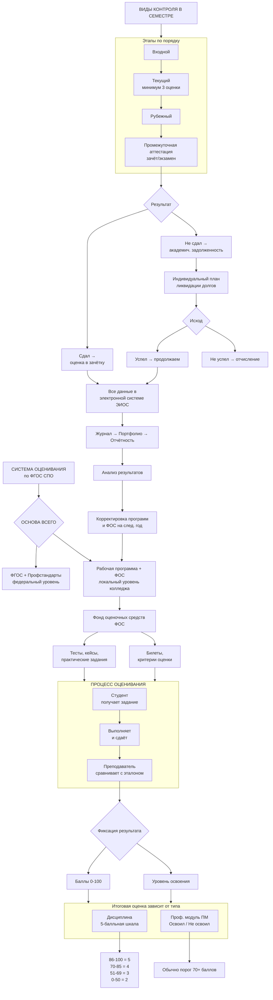

**Ключевые принципы (кратко):**
```
1.  СПРАВЕДЛИВОСТЬ     — Правила едины для всех, есть апелляция
2.  ОТКРЫТОСТЬ        — Критерии известны заранее
3.  ПРАКТИКА          — Оценивают реальные проф. умения
4.  СИСТЕМНОСТЬ       — Все этапы связаны: от ФГОС → до оценки в дипломе
```
